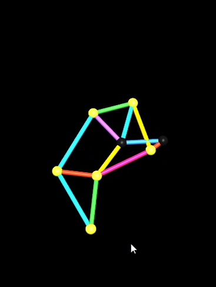
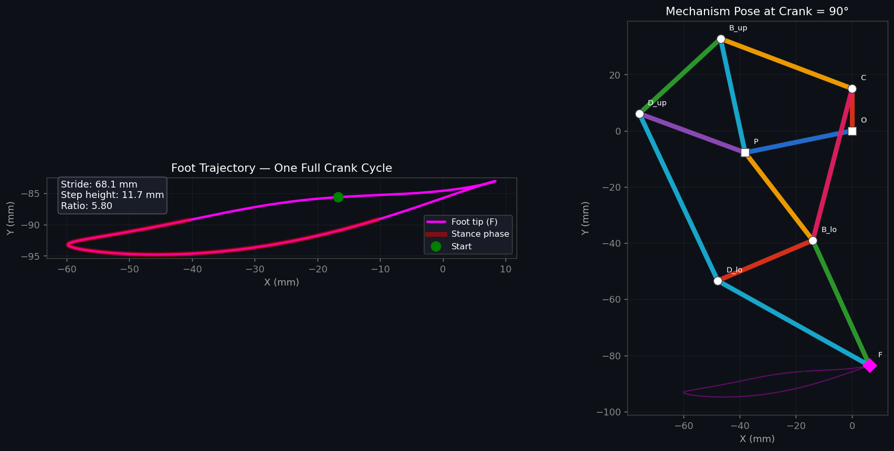
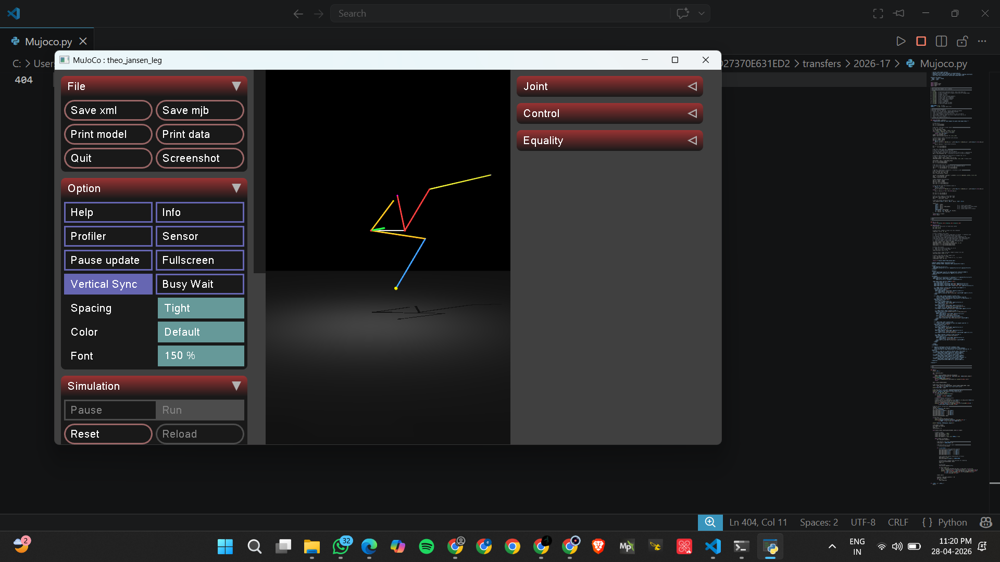

# Theo Jansen Mechanism Simulation using MuJoCo

A Python-based simulation and visualization of the **Theo Jansen walking mechanism** using **MuJoCo**, analytical kinematics, and trajectory analysis.

This project recreates the famous Theo Jansen leg mechanism and visualizes:
- Linkage motion
- Foot trajectory
- Crank-driven walking cycle
- MuJoCo interactive rendering
- Analytical kinematic replay

---

# 📌 Project Overview

The Theo Jansen mechanism is a linkage system designed to create smooth walking motion using rotating cranks and interconnected rods.

In this project:
- The mechanism kinematics are solved analytically using **circle-circle intersection methods**
- The motion is replayed inside **MuJoCo**
- Foot trajectories and walking characteristics are visualized using **Matplotlib**
- Both static plots and animated simulations are generated

---

# 🛠️ Technologies Used

- Python
- MuJoCo
- NumPy
- Matplotlib
- ImageIO

---

# 📂 Features

✅ Analytical kinematic solution of Theo Jansen linkage  
✅ MuJoCo visualization and interactive viewer  
✅ Static trajectory plotting  
✅ Animated walking cycle generation  
✅ Foot trajectory analysis  
✅ Link orientation using quaternion rotations  
✅ GIF generation for motion visualization  

---

# 📸 Simulation Outputs

## Mechanism Configuration

### Model



---

## Foot Trajectory and Pose Analysis



This plot shows:
- Foot trajectory during one full crank cycle
- Stance phase
- Step height
- Stride length
- Mechanism pose at 90° crank angle

---

# 🧪 Early Simulation Attempts

These were some of the initial simulation attempts while building the mechanism geometry and validating linkage behavior.

## Prototype Attempt 1



---

# ⚙️ How the Simulation Works

The mechanism is generated using:
- Fixed linkage lengths (Theo Jansen “holy numbers”)
- Analytical geometry
- Circle-circle intersection for joint solving
- Quaternion-based link alignment for MuJoCo rendering

The code computes:
- Joint coordinates
- Link orientations
- Foot trajectory
- Frame-by-frame animation

---

# 📈 Kinematic Highlights

| Parameter | Value |
|---|---|
| Mechanism Type | Theo Jansen Leg |
| Solver Method | Analytical Geometry |
| Rendering Engine | MuJoCo |
| Visualization | Matplotlib |
| Animation Output | GIF |
| Coordinate System | 2D Kinematics + 3D Rendering |

---

# 🚀 Installation

## 1️⃣ Clone Repository

```bash
git clone https://github.com/your-username/theo-jansen-mujoco.git
cd theo-jansen-mujoco
```

---

## 2️⃣ Install Dependencies

```bash
pip install numpy matplotlib imageio mujoco
```

---

# ▶️ Run the Simulation

```bash
python jansen_mujoco.py
```

Outputs generated:
- `jansen_mujoco.gif`
- `jansen_mujoco.png`
- Optional MuJoCo 3D render GIF
- Interactive MuJoCo viewer window

---

# 📁 Project Structure

```bash
├── jansen_mujoco.py
├── jansen_mujoco.gif
├── jansen_mujoco.png
├── Screenshot (154).png
├── Screenshot (155).png
└── README.md
```

---

# 🧠 Mathematical Approach

The linkage positions are solved using:
- Circle-circle intersection equations
- Geometric constraints
- Crank-angle parameterization

Core concepts used:
- Forward kinematics
- Quaternion rotations
- Rigid-body link alignment

Example linkage equations:

```math
(x-x_1)^2+(y-y_1)^2=r_1^2
```

```math
(x-x_2)^2+(y-y_2)^2=r_2^2
```

Their intersection gives the next joint position.

---

# 📚 Reference & Acknowledgement

This project was created primarily for:
- Learning kinematics
- Exploring mechanism design
- Understanding MuJoCo visualization workflows

We would also like to mention that:
- Some portions of the implementation and debugging assistance were completed with the help of AI tools during development.
- The project includes both original work and AI-assisted coding support used for learning and experimentation purposes.

---

# 🔮 Future Improvements

- Full physics-based walking simulation
- Ground contact dynamics
- Multi-leg Strandbeest body
- Motor-driven actuation
- Real-time parameter tuning
- Reinforcement learning integration

---

# 👨‍💻 Author

Developed as a learning and exploration project in:
- Robotics
- Mechanism Design
- Simulation
- MuJoCo Physics Engine

---

# ⭐ If You Like This Project

Feel free to:
- Star the repository
- Fork the project
- Suggest improvements
- Contribute new ideas

